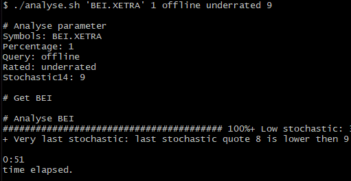
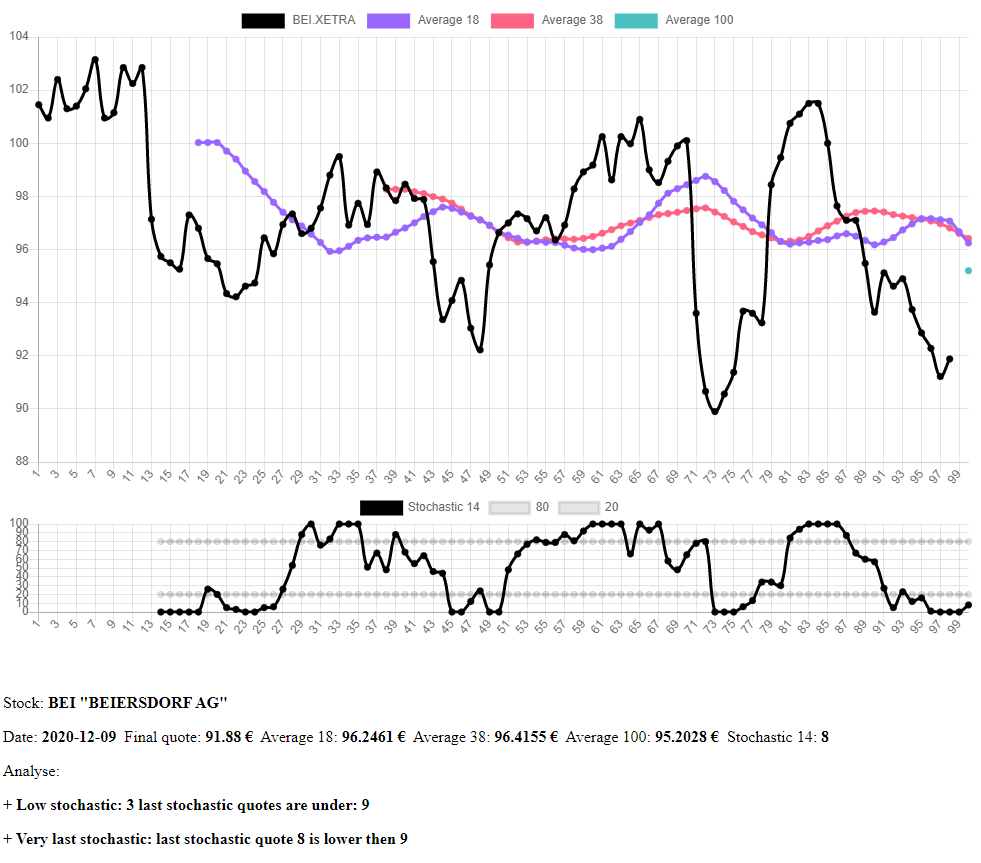

# Stock Analyse
Automated Stock Analysis.

This script checks given stock quotes and their averages of the last 100, 38, 18 days.

# Run

# Result

## Outputs:
- data/SYMBOL.txt
- out/SYMBOL.html
- out/_result.html
- out/_out.tar.gz

# Execute

## CMD
./analyse.sh SYMBOLS PERCENTAGE QUERY RATED STOCHASTIC

./analyse.sh 'BEI' 1 online overrated 9

./analyse.sh 'BEI ALV BAS' 2 offline underrated 9

## Github Action
https://github.com/Hefezopf/stock-analyse/actions

## Schedule pre configured in 
https://github.com/Hefezopf/stock-analyse/blob/main/.github/workflows/schedule.workflow.yml

## cURL
./curl_github_dispatch.sh "BEI" 1 offline underrated 9

or Example

curl -H "Authorization: token $GITHUB_TOKEN" -H 'Accept: application/vnd.github.everest-preview+json' "https://api.github.com/repos/Hefezopf/stock-analyse/dispatches" -d '{"event_type": "curl", "client_payload": {"symbols": "BEI", "percentage": "1", "query": "offline", "rated": "underrated", "stochastic": "20"}'

# REST Call

REST calls to external services
## Marketstack
curl  --location --request GET "http://api.marketstack.com/v1/eod?access_key=${MARKET_STACK_ACCESS_KEY}&exchange=XETRA&symbols=BEI" | jq '.data[].close'

## OpenFIGI
curl --request POST 'https://api.openfigi.com/v2/mapping' --header 'Content-Type: application/json' --header 'echo ${X_OPENFIGI_APIKEY}' --data '[{"idType":"TICKER", "idValue":"'${1}'"}]' | jq '.[0].data[0].name'

